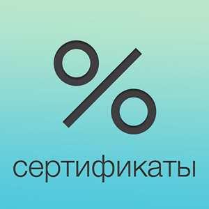

<a name="readme-top"></a>

<!-- PROJECT SHIELDS -->
[![Version][version-shield]][version-url]
[![Downloads][downloads-shield]][downloads-url]
[![Contributors][contributors-shield]][contributors-url]
[![Forks][forks-shield]][forks-url]
[![Stargazers][stars-shield]][stars-url]
[![Issues][issues-shield]][issues-url]
[![Apache 2.0 License][license-shield]][license-url]


<!-- PROJECT LOGO -->
<br />
<div align="center">
  <a href="https://github.com/softc24/evotor-certificates-php">
    
  </a>

  <h3 align="center">API-клиент приложение <a href="https://market.evotor.ru/store/apps/005688e8-dd3b-4c56-9550-0290710daccc">"ДисконтКлуб Сертификаты"</a></h3>

  <p align="center">
    Клиент для использования API приложения "ДисконтКлуб Сертификаты" для сторонних систем.
    <br />
    <!-- <a href="https://github.com/softc24/evotor-certificates-php"><strong>Explore the docs »</strong></a>
    <br />
    <br />
    <a href="https://github.com/softc24/evotor-certificates-php">View Demo</a>
    · -->
    <a href="https://github.com/softc24/evotor-certificates-php/issues">Report Bug</a>
    ·
    <a href="https://github.com/softc24/evotor-certificates-php/issues">Request Feature</a>
  </p>
</div>

<!-- TABLE OF CONTENTS -->
- [About The Project](#about-the-project)
  - [Built With](#built-with)
- [Getting Started](#getting-started)
  - [Prerequisites](#prerequisites)
  - [Installation](#installation)
- [Usage](#usage)
- [Roadmap](#roadmap)
- [Contributing](#contributing)
- [License](#license)
- [Contact](#contact)


<!-- ABOUT THE PROJECT -->
## About The Project

<!-- [![Product Name Screen Shot][product-screenshot]](https://example.com) -->

Библиотека предоставляет доступ к <a href="https://certs.evotor.tech/docs/">API приложения "ДисконтКлуб Сертификаты"</a>.

<p align="right">(<a href="#readme-top">back to top</a>)</p>


### Built With

* [![PHP][PHP]][PHP-url]

<p align="right">(<a href="#readme-top">back to top</a>)</p>


<!-- GETTING STARTED -->
## Getting Started

### Prerequisites

Используется библиотека **HTTPlug** согласно https://docs.php-http.org/en/latest/httplug/users.html.

### Installation

Рекомендованный способ установки с помощью Composer:

```
$ composer require softc/evotor-certificates
```

<p align="right">(<a href="#readme-top">back to top</a>)</p>


<!-- USAGE EXAMPLES -->
## Usage

```php
<?php

require 'vendor/autoload.php';

use SoftC\Evotor\Certificates\Api\Domain\CertificateActivate;
use SoftC\Evotor\Certificates\Api\Domain\CertificateCreate;
use SoftC\Evotor\Certificates\Api\Domain\CertificatePay;
use SoftC\Evotor\Certificates\Api\Entities\CertificateType;
use SoftC\Evotor\Certificates\Api\Enums\EntityStatus;
use SoftC\Evotor\Certificates\Api\Requests\CertificatesActivateRequest;
use SoftC\Evotor\Certificates\Api\Requests\CertificatesCreateRequest;
use SoftC\Evotor\Certificates\Api\Requests\CertificatesPayRequest;

$token = 'api-token';
$client = new Client($token);

// получить виды сертификатов
$types = $client->SelectTypes();
// оставляем только активные виды сертификатов с указанным номиналом
$types = array_filter($types, static fn(CertificateType $item) => $item->status === EntityStatus::ACTIVE && $item->value > 0);

// используем первый вид
$type = $types[0];

// создаем сертификат с произвольным номером
$number = bin2hex(random_bytes(16));
$certs = $client->CreateCertificates(new CertificatesCreateRequest([
    new CertificateCreate($number, $type->uuid)
]));

// получаем ИД созданного сертификата
$uuid = $certs[0];

// также можно найти сертификат по номеру
// $cert = $client->GetCertificateByNumber($number);

// активируем сертификат
$client->ActivateCertificates(new CertificatesActivateRequest(
    bin2hex(random_bytes(18)),
    [
        new CertificateActivate($uuid, $type->uuid)
    ]
));

// гасим сертификат
$client->PayCertificates(new CertificatesPayRequest(
    bin2hex(random_bytes(18)),
    [
        new CertificatePay($uuid, $type->value ?? 0)
    ]
));

```

<!-- _For more examples, please refer to the [Documentation](https://example.com)_ -->

<p align="right">(<a href="#readme-top">back to top</a>)</p>


<!-- ROADMAP -->
## Roadmap

See the [open issues](https://github.com/softc24/evotor-certificates-php/issues) for a full list of proposed features (and known issues).

<p align="right">(<a href="#readme-top">back to top</a>)</p>


<!-- CONTRIBUTING -->
## Contributing

Contributions are what make the open source community such an amazing place to learn, inspire, and create. Any contributions you make are **greatly appreciated**.

If you have a suggestion that would make this better, please fork the repo and create a pull request. You can also simply open an issue with the tag "enhancement".
Don't forget to give the project a star! Thanks again!

1. Fork the Project
2. Create your Feature Branch (`git checkout -b feature/AmazingFeature`)
3. Commit your Changes (`git commit -m 'Add some AmazingFeature'`)
4. Push to the Branch (`git push origin feature/AmazingFeature`)
5. Open a Pull Request

<p align="right">(<a href="#readme-top">back to top</a>)</p>


<!-- LICENSE -->
## License

Distributed under the Apache-2.0 license. See `LICENSE.txt` for more information.

<p align="right">(<a href="#readme-top">back to top</a>)</p>


<!-- CONTACT -->
## Contact

Project Link: [https://github.com/softc24/evotor-certificates-php](https://github.com/softc24/evotor-certificates-php)

<p align="right">(<a href="#readme-top">back to top</a>)</p>


<!-- ACKNOWLEDGMENTS -->
<!-- ## Acknowledgments

Use this space to list resources you find helpful and would like to give credit to. I've included a few of my favorites to kick things off!

* [Choose an Open Source License](https://choosealicense.com)
* [GitHub Emoji Cheat Sheet](https://www.webpagefx.com/tools/emoji-cheat-sheet)
* [Malven's Flexbox Cheatsheet](https://flexbox.malven.co/)
* [Malven's Grid Cheatsheet](https://grid.malven.co/)
* [Img Shields](https://shields.io)
* [GitHub Pages](https://pages.github.com)
* [Font Awesome](https://fontawesome.com)
* [React Icons](https://react-icons.github.io/react-icons/search)

<p align="right">(<a href="#readme-top">back to top</a>)</p> -->


<!-- MARKDOWN LINKS & IMAGES -->
<!-- https://www.markdownguide.org/basic-syntax/#reference-style-links -->
[contributors-shield]: https://img.shields.io/github/contributors/softc24/evotor-certificates-php.svg?style=for-the-badge
[contributors-url]: https://github.com/softc24/evotor-certificates-php/graphs/contributors
[forks-shield]: https://img.shields.io/github/forks/softc24/evotor-certificates-php.svg?style=for-the-badge
[forks-url]: https://github.com/softc24/evotor-certificates-php/network/members
[stars-shield]: https://img.shields.io/github/stars/softc24/evotor-certificates-php.svg?style=for-the-badge
[stars-url]: https://github.com/softc24/evotor-certificates-php/stargazers
[issues-shield]: https://img.shields.io/github/issues/softc24/evotor-certificates-php.svg?style=for-the-badge
[issues-url]: https://github.com/softc24/evotor-certificates-php/issues
[license-shield]: https://img.shields.io/github/license/softc24/evotor-certificates-php.svg?style=for-the-badge
[license-url]: https://github.com/softc24/evotor-certificates-php/blob/master/LICENSE.txt
[downloads-shield]: https://img.shields.io/packagist/dm/softc/evotor-certificates.svg?style=for-the-badge
[downloads-url]: https://packagist.org/packages/softc/evotor-certificates/stats
[version-shield]: https://img.shields.io/packagist/v/softc/evotor-certificates.svg?style=for-the-badge
[version-url]: https://packagist.org/packages/softc/evotor-certificates
[product-screenshot]: docs/screenshot.png
[PHP]: https://img.shields.io/badge/PHP-000000?style=for-the-badge&logo=php&logoColor=white
[PHP-url]: https://php.net/